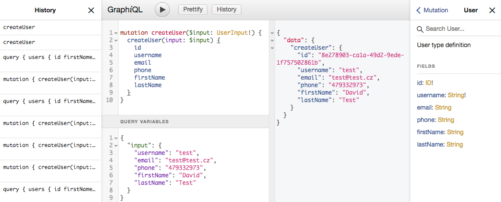

# GraphiQL



To make it easier to test, explore and experiment with the API we’ve set up [Salient](http://salient.edrcore.com:3000/graphiql) running GraphiQL, an official open-source GraphQL project, which gives you a code editor with auto-complete and inline documentation.

```
URL: http://salient.edrcore.com:3000/graphiql
```